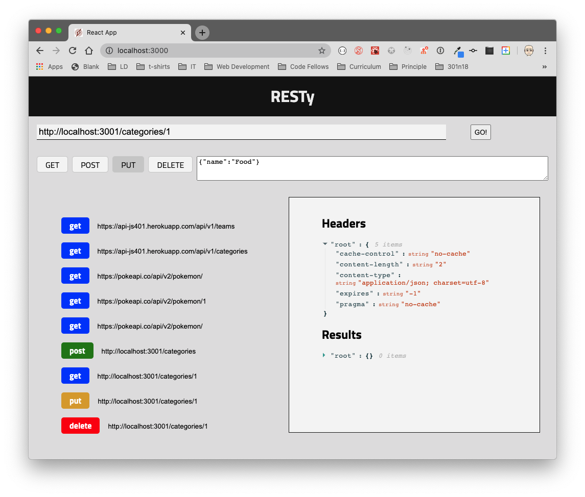

# RESTy

A browser based API testing tool

## Business Requirements

Our application will be an API testing tool that can be run in any browser, allowing a user to easily interact with APIs in a familiar interface.

[Live Example](https://resty.netlify.app/)



The core requirements and functionality are as follows:

- Simple, intuitive user interface
  - A form where a user:
    - Enters a REST API Endpoint (URI)
    - Selects the REST Method to use (`get`, `post`, `put`, `delete`)
    - For `put` and `post`, allow the user to enter JSON to be used as the body for the request
    - A button to initiate the request
  - An output section which:
    - Displays a spinner to indicate a request is in process
    - Once a request is complete:
      - Hide the spinner
      - Display a well formatted view of the API response in 2 sections
        - Headers
        - Body
  - A history section which:
    - Shows a list of all unique, successful requests
    - Allows a user to click or select one to re-populate the form so they can repeat the request

## Technical Requirements

The application will be created with the following overall architecture and methodologies

1. React
1. ES6 Classes
1. Shared Component State
1. Local Storage for storing request history
1. Superagent or Axios for performing API Requests
1. SASS for styling
   - Global Theme
   - Component specific CSS where possible
1. Test Driven Development, using Jest
   - Tests will be runnable locally
1. Deployment to GitHub Pages using an Action

### Application Structure (proposed)

```text
├── .gitignore
├── .eslintrc.json
├── __tests__
│   ├── app.test.js
│   ├── form.test.js
│   ├── history.test.js
│   └── results.test.js
├── public
|   └── index.html
├── src
│   ├── index.jsx
│   ├── app.jsx
│   ├── components
│   │   ├── if
│   │   │   └── if.jsx
│   │   ├── form
│   │   │   └── form.jsx
│   │   │   └── form.scss
│   │   ├── history
│   │   │   └── history.jsx
│   │   │   └── history.scss
│   │   ├── results
│   │   │   └── results.jsx
│   │   │   └── results.scss
│   │   ├── header
│   │   │   └── header.jsx
│   │   │   └── header.scss
│   ├── design
│   │   └── variables.scss
│   │   └── design.scss
└── package.json
```

## Development Process, Milestones

1. **Phase 1: Application Setup**
   - Basic React Application
   - Scaffolding
   - Basic State
   - Rendering
1. **Phase 2: Testing and Deployment**
   - Testing of React components and applications
   - Uses best practices for testing Behaviors and Acceptance Criteria
   - Integrates with an online CI framework
   - Deploy to GitHub Pages, Netlify, and/or AWS
1. **Phase 3: State and Props**
   - Create multiple components to handle each aspect of the Application
   - Sharing state and behaviors between components
   - Basic layout and styling
1. **Phase 4: Fit and Finish**
   - Incorporate the spinner, using conditional rendering
   - App is Fully Tested
   - App is Fully Documented
   - `RESTy` is Deployed and publicly available
