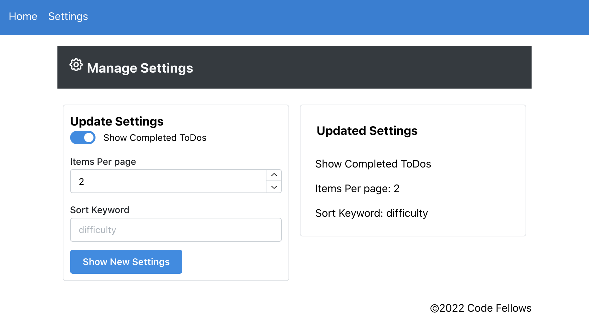

# LAB: Context API - Behaviors

**To Do List Manager Phase 2:** Incorporate configuration settings to the application.

In this phase, we'll be adding a settings editor so that users can save their preferences for the application, allowing them to change some of the default behaviors.

## Before you begin

Refer to *Getting Started*  in the [lab submission instructions](../../../reference/submission-instructions/labs/README.md) for complete setup, configuration, deployment, and submission instructions.

1. Continue to work in your GitHub Repository named `todo-app`.
1. Create and work in a new branch for today called 'context-methods'.

## Business Requirements

Refer to the [To Do System Overview](../../apps-and-libraries/todo/README.md) for a complete review of the application, including Business and Technical requirements along with the development road map.

## Phase 2 Requirements

In Phase 2, we're going to extend the functionality of our application by allowing the user to make some decisions on how they would like the application to function. Specifically, we'll let them make changes to 2 settings.

- Implement the Context API to make some basic application settings available to components.
  - How many To Do Items to show at once.
  - Whether or not to show completed items.
  - *Hint: if reusing the custom `useForm()` hook, event validation may be necessary if using any Mantine component other than `<TextInput />`.*
- Provide the users with a form where they can change the values for those settings.
  - This should be given in the form of a new component, perhaps linked to from the main navigation.
  - *Hint: Use Browser Router to create the page/route/component for this.*
  - Once settings are updated, render the updated settings to the right of the "form".  Consider using `<Grid />`, `<Card />`, and `<When />` components.
- Save the users choices in Local Storage.
- Retrieve their preferences from Local Storage and apply them to the application on startup.

### Todo Comp


### Settings Comp




## Technical Requirements / Notes

> Technical requirements for the core application are unchanged from the prior phases, with the addition of context behaviors defined in our global Context Provider.

1. Extend your `context` provider to include all of the following features:
   - Create a `context` for managing application settings and provide this at the application level.
   - Display or Hide completed items (boolean).
   - Number of items to display per screen (number).
   - Default sort field (string).
   - Create a function in your context that saves user preferences (for the above) to local storage.
   - Implement a `useEffect()` (or `componentDidMount()`) in your context to read from local storage and set the values for those 2 state properties on application load.
   > Note: You will need to `stringify()` your state prior to saving to local storage, and parse it when you retrieve it.

1. Consume and utilize `Context` values throughout your components:
    - Show a maximum of a certain number of items per screen in the `<List />` component.
      - Properly implement the Mantine `<Pagination />` component functionality to let the users navigate a long list of items with the correct number of tasks showing per "page".
    - Hide or show completed items in the list.

## Proposed File Structure

In this proposal:
- Utilize [Airbnb React/JSX Style Guide](https://airbnb.io/javascript/react/) conventions.
- unit tests are placed in the component directory (testing one file only).
- integration tests are placed in the `__tests__` directory (testing more than one file).

```text
├── .github
│   ├── workflows
│   │   └── node.yml
├── public
├── src
│   ├── __tests__
│   │   ├── App.test.jsx
│   ├── Components
│   │   ├── Footer
│   │   │   └── index.jsx
│   │   ├── Header
│   │   │   └── index.jsx
│   │   ├── List
│   │   │   └── index.jsx
│   │   ├── SettingsForm
│   │   │   └── index.jsx
│   │   ├── Todo
│   │   │   ├── index.jsx
│   │   │   └── styles.scss  
│   ├── Context
│   │   ├── Settings
│   │   │   ├── index.jsx
│   │   │   └── settings.test.jsx
│   ├── hooks
│   │   └── form.js
│   ├── App.jsx
│   └── index.js
├── .gitignore
├── package-lock.json
├── package.json
└── README.md
```

## Stretch Goal:

- Sort the items based on any of the keys (i.e. difficulty).
- Update the state handling for todo items to use `useReducer()` vs separate state management methods.

## Testing

- Tests should assert all behavioral functionality.
- Do a deep mount of the app, and set tests to make assertions on the child components that consume context from the Provider.
  - Can they see context?

## Assignment Submission Instructions

Refer to the the [Submitting React Apps Lab Submission Instructions](../../../reference/submission-instructions/labs/react-apps.md) for the complete lab submission process and expectations.
