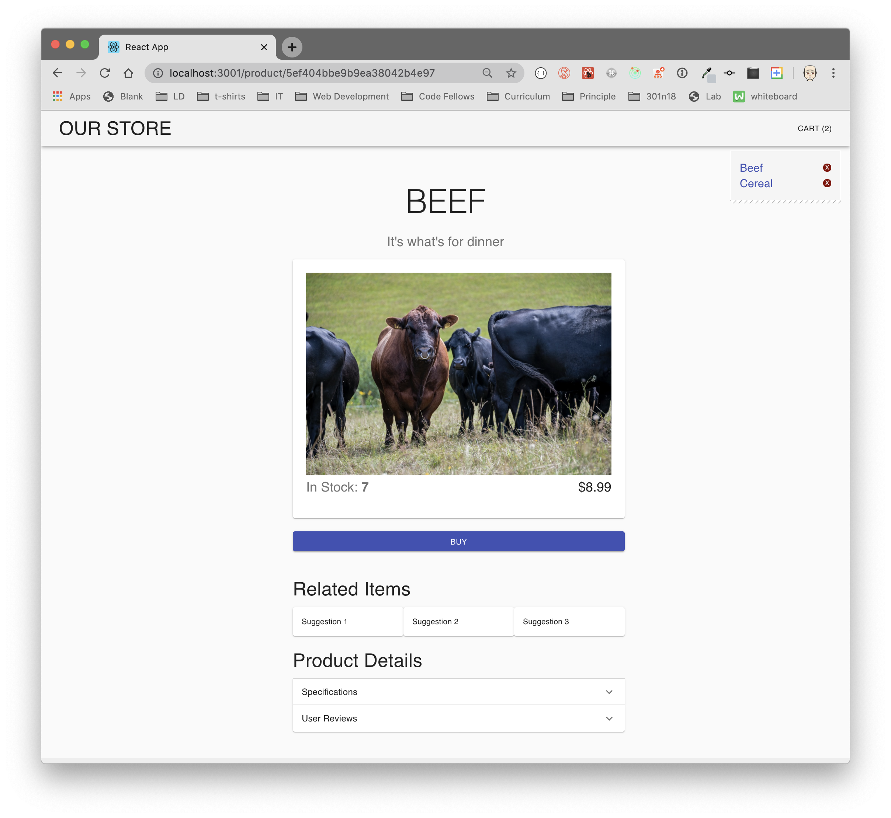
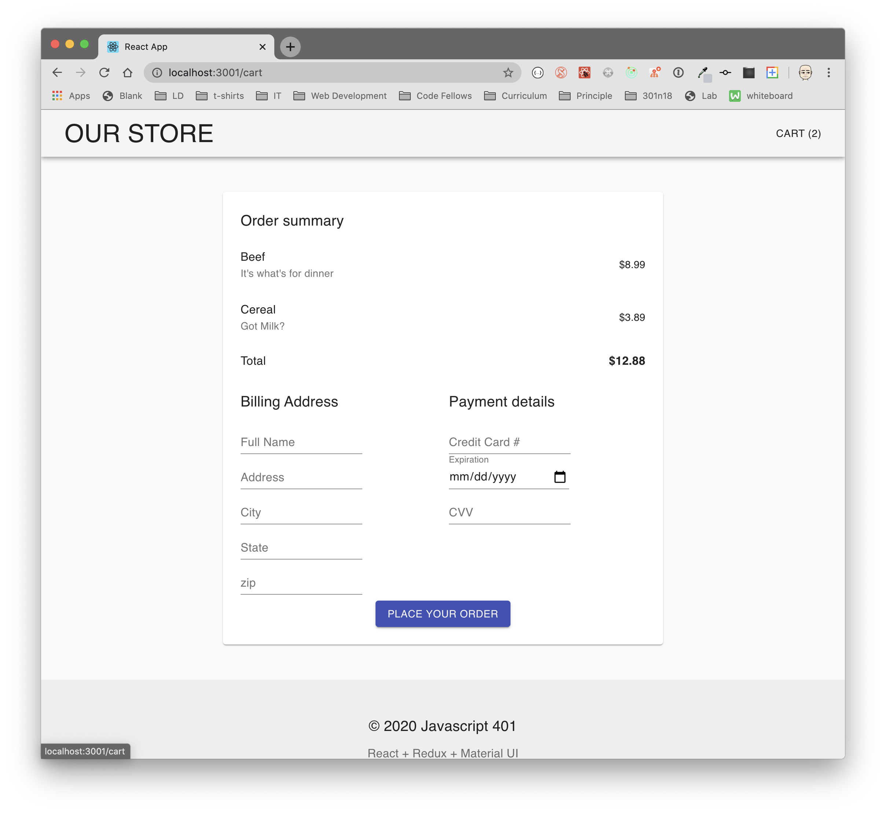

# Lab: Redux - Additional Topics

**Virtual Store Phase 4:**  Complete work on the Virtual Store by adding detail pages for individual products as well as the the cart checkout page.

## Before you begin

Refer to *Getting Started*  in the [lab submission instructions](../../../reference/submission-instructions/labs/README.md) for complete setup, configuration, deployment, and submission instructions.

> Continue working in your 'storefront' repository, in a branch called 'rtk'.

## Business Requirements

Refer to the [Virtual Store System Overview](../../apps-and-libraries/store/README.md) for a complete review of the application, including Business and Technical requirements along with the development roadmap.

## Phase 4 Requirements

In phase 4, we will be completing work on our Virtual Store by adding two full page views to the application: Product Details and Checkout.

The user stories from Phases 1, 2 and 3 remain unchanged. For this phase, we are now adding the following new user stories to meet the new requirements.

- As a user, I want to see a full detail view of a product so that I can make a more informed choice about purchasing it.
- As a user, I want to view my full cart and initiate the checkout process so that I can purchase my items and have them delivered.

**Product Details Page**



**Cart Page**



## Technical Requirements / Notes

And as developers, here are the high level development tasks that address the above end user requirements and workflow.

- Add routing to the application.
- Link every product to a page that displays the full product details.
- Link the "Cart" summary in the header to a full shopping cart page with shipping/payment forms.
- Additionally, we will be swapping out our Redux store and replacing it with a store built using Redux Toolkit.

### Application Architecture

- Add `<BrowserRouter />` to your application.
  - Create a `<Storefront />` component to contain all of the components viewable form the `/` route.
- Create a new page component: `<ProductDetails />`.
  - Alter each product on the listing screen to have a new "Product Details" button.
  - When clicked, `<Link to...>` /products/## where ## is the product ID.
  - On this page, show an expanded view of the product, including placeholders for additional information such as reviews, suggestions, etc.
- Create a new page component: `<ShoppingCart />`
  - Link to this page from the `Cart (x)` in the header, on the `/cart` route.
  - On this page, show:
    - A summary of items in tabular format.
    - A final order total.
    - A form allowing the user to enter their billing/shipping address and credit card information.
    - On submit, simply draw an alert that says "Thank you for your purchase"
      - We will **not** be processing transactions or storing orders just yet.

### Proposed File Structure

```text
├── .github
│   ├── workflows
│   │   └── node.yml
├── public
├── src
│   ├── __tests__
│   │   └── App.test.jsx (integration test)
│   ├── Components
│   │   ├── Categories
│   │   │   ├── Categories.test.jsx (unit test)
│   │   │   └── index.jsx
│   │   ├── Footer
│   │   │   ├── Footer.test.jsx
│   │   │   └── index.jsx
│   │   ├── Header
│   │   │   ├── Header.test.jsx
│   │   │   └── index.jsx
│   │   ├── ShoppingCart
│   │   │   ├── index.jsx
│   │   │   └── ShoppingCart.test.jsx
│   │   ├── SimpleCart
│   │   │   └── index.jsx
│   │   │   ├── SimpleCart.test.jsx
│   │   ├── Storefront
│   │   │   └── index.jsx
│   │   ├── ProductDetails
│   │   │   ├── index.jsx
│   │   │   └── ProductDetails.test.jsx
│   │   └── Products
│   │       ├── index.jsx
│   │       └── Product.test.jsx
│   ├── store
│   │   ├── cart.js
│   │   ├── categories (notice structure with unit test)
│   │   │   ├── categories.test.js
│   │   │   └── index.js
│   │   ├── index.js
│   │   └── products.js
│   ├── App.jsx
│   ├── App.scss
│   └── index.js
├── .gitignore
├── .eslintrc.json
├── package.json
└── README.md
```

### Notes on State Management

- While we will still be using Redux, the technical requirement for this phase is to refactor existing actions and reducers into the new **Redux Toolkit** framework/pattern.
  - Note that there is no new state functionality (the two pages are read-only), but the underlying architecture will be new.

> **RECOMMENDATION:** complete the core features first. Once the new pages are added and properly working, then begin the work of swapping the current Redux Store for the Redux Toolkit version of the store. Do this tactically, so that you can easily switch between implementations if you need to.

### Testing

- Behavioral tests are required to assert all user stories are properly completed and operational.

### Assignment Submission Instructions

Refer to the the [Submitting React Apps Lab Submission Instructions](../../../reference/submission-instructions/labs/react-apps.md) for the complete lab submission process and expectations.

### Implementation Notes/Details

- Add `<BrowserRouter/>` to your application so that you can build the menu in the header.
- Create the following components for the Home Page:
  - `<Categories />`
    - Shows a list of all categories.
    - Dispatches an action when one is clicked to "activate " it.
  - `<Products />`
    - Displays a list of products associated with the selected category.
  - `<SimpleCart />`
    - Displays a short list (title only) of products in the cart.
- Create the following component for the Cart Page:
  - `<Cart />`
    - Displays a list of products currently in the cart.

-----------

- When the "View Details" button is clicked for a product:
  - Open a modal with the full product details, including the number in stock.
  - If the number in stock > 0, also show an "add to cart" button.
  - When a user clicks the "add to cart" button add the item to their cart.
    - On the page, show a running list of the items in the cart (just the titles).
    - Change the `(0)` indicator in the header to show the actual number of items in the cart.
  - Reduce the number in stock for that product.
- Cart Page Operation:
  - When showing the Cart Page ...
  - Show a full listing of each product in the users' cart (name, description, etc).
